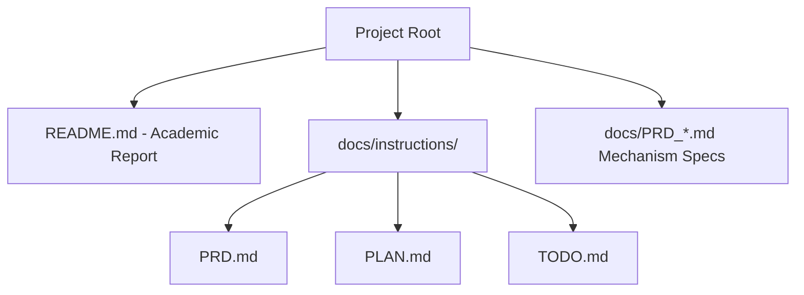

# Technical Development Plan
## Feature: Academic Documentation & Architecture Specification (`police_academic_documentation_prds`)

### 1. Technical Architecture & Component Design
This plan specifies the documentation generation and structure for `police_academic_documentation_prds`.

### 2. Technical Component Breakdown
- **Component 1**: Author root `README.md` containing Dec-POMDP 8-tuple definition, architecture diagrams, installation guide, and submission checklist.
- **Component 2**: Populate `docs/instructions/PRD.md` with complete project requirements.
- **Component 3**: Populate `docs/instructions/PLAN.md` with phase-by-phase implementation details.
- **Component 4**: Populate `docs/instructions/TODO.md` with developer task breakdown.
- **Component 5**: Author mechanism PRDs (`docs/PRD_commit_reveal.md`, `docs/PRD_bayesian_belief.md`, `docs/PRD_scent_tracking.md`, `docs/PRD_gatekeeper.md`).

### 3. Dependencies & Internal Integrations
- **Markdown & Mermaid**: GitHub Flavored Markdown (GFM), Mermaid diagrams, LaTeX math syntax.

### 4. Implementation Strategy & Risk Mitigation
- **Verification**: Cross-check all file references and code links to ensure zero broken links.
