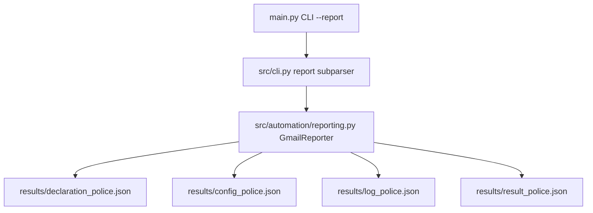

# Technical Development Plan
## Feature: Match Artifact Export CLI Subcommand (`police_artifact_export_cli_cmd`)

### 1. Technical Architecture & Component Design
This plan outlines `police_artifact_export_cli_cmd` engineering as defined in `police_artifact_export_cli_cmd_prd.md`.

### 2. Technical Component Breakdown
- **Component 1**: Add `report` subparser to `create_parser()` in `src/cli.py`.
- **Component 2**: Add `handle_report_command(args)` reading input trajectory log and writing 4 JSON artifact files.

### 3. Dependencies & Internal Integrations
- **Language / Runtime**: Python 3.11+
- **Internal Modules**: `src/cli.py`, `src/automation/reporting.py`

### 4. Implementation Strategy & Risk Mitigation
- **Validation**: Ensure output directory `results/` is created if absent.
