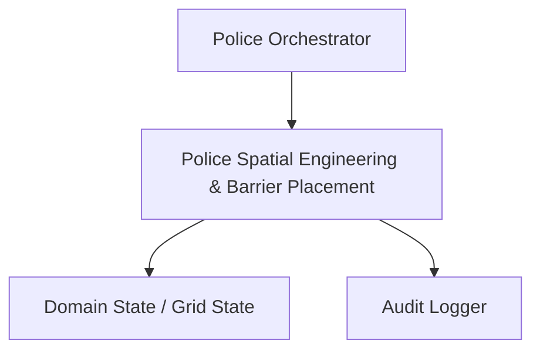

# Technical Development Plan
## Feature: Police Spatial Engineering & Barrier Placement (`police_barrier_engineering`)

### 1. Technical Architecture & Component Design
As Team Leader, this development plan outlines the engineering implementation of `police_barrier_engineering` based on the product requirements defined in `police_barrier_engineering_prd.md`.

#### Module Architecture
This feature resides within the Police agent codebase and integrates into the system via clean interface boundaries.

### 2. Technical Component Breakdown
- **Component 1**: Design BarrierManager class tracking active grid barriers and remaining quota.
- **Component 2**: Implement placement validation (check distance 1, check non-occupancy, check quota).
- **Component 3**: Create spatial engineering heuristic utility for evaluating path blocking opportunities.
- **Component 4**: Integrate barrier state updates into global match state.

### 3. Dependencies & Internal Integrations
- **Language / Runtime**: Python 3.11+
- **Internal Modules**: `src/core/orchestrator.py`, `src/core/state_machine.py`, `src/domain/`
- **External Libraries**: Standard Python Library (`hashlib`, `secrets`, `dataclasses`, `typing`, `json`, `math`, `asyncio`).

### 4. Implementation Strategy & Risk Mitigation
- **Phased Rollout**: Implement core interface data types first, followed by business logic and unit test suite.
- **Risk Mitigation**: Strict boundary checks and zero-trust verification to prevent invalid game state transitions or out-of-order execution.
