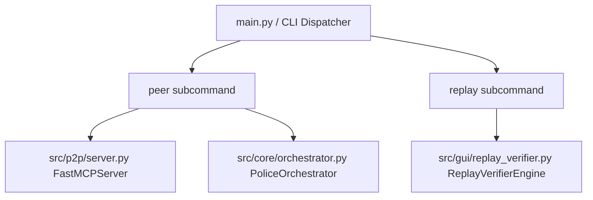

# Technical Development Plan
## Feature: Application CLI Runner & Executable Entry Points (`police_cli_entrypoint_runner`)

### 1. Technical Architecture & Component Design
This technical plan defines the implementation of `police_cli_entrypoint_runner` based on `police_cli_entrypoint_runner_prd.md`.

### 2. Technical Component Breakdown
- **Component 1**: Create `src/cli.py` with `argparse` subparser structure for `peer` and `replay`.
- **Component 2**: Connect `peer` subcommand to `FastMCPServer` and `PoliceOrchestrator` lifecycle methods.
- **Component 3**: Connect `replay` subcommand to `ReplayVerifierEngine` step audit routine.
- **Component 4**: Add root `main.py` entry script and `__main__.py` in package.

### 3. Dependencies & Internal Integrations
- **Language / Runtime**: Python 3.11+
- **Internal Modules**: `src/p2p/server.py`, `src/gui/replay_verifier.py`, `src/core/orchestrator.py`
- **External Libraries**: `argparse`, `sys`, `json`, `pathlib`

### 4. Implementation Strategy & Risk Mitigation
- **Phased Rollout**: Build argument parsing first, wire server startup, then wire replay verifier.
- **Signal Handling**: Attach SIGINT handler to safely shut down servers and flush audit logs before exiting.
