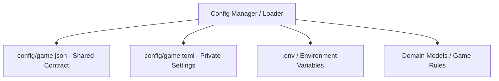

# Technical Development Plan
## Feature: Shared Contract & Configuration Management (`police_config_contract_management`)

### 1. Technical Architecture & Component Design
This development plan outlines the engineering implementation for `police_config_contract_management` as specified in `police_config_contract_management_prd.md`.

### 2. Technical Component Breakdown
- **Component 1**: Create `config/game.json` containing the complete 8-tuple specification for the 7x7 grid, cop/thief start points, barrier limits, and scoring table.
- **Component 2**: Create `config/game.toml` providing private per-peer settings (`my_port = 8802`, `opponent_url`, LLM settings, and strategy selection).
- **Component 3**: Implement configuration parsing and validation logic in `src/domain/config_loader.py` (or `src/infra/config.py`).
- **Component 4**: Define root `pyproject.toml` containing project metadata, dependencies (`fastmcp`, `pydantic`, `pytest`, `pytest-cov`, `ruff`), and ruff/coverage configurations.
- **Component 5**: Provide `.env-example` and lockfile specifications (`uv.lock`).

### 3. Dependencies & Internal Integrations
- **Language / Runtime**: Python 3.11+
- **Internal Modules**: `src/domain/grid.py`, `src/domain/barriers.py`, `src/core/orchestrator.py`
- **External Libraries**: `tomli` / `tomllib`, `json`, `jsonschema`, `os`

### 4. Implementation Strategy & Risk Mitigation
- **Validation First**: Validate `config/game.json` against JSON schema on startup before initializing any network server.
- **Git Safety**: Ensure `.env`, `credentials.json`, and `token.json` are listed in `.gitignore`.
