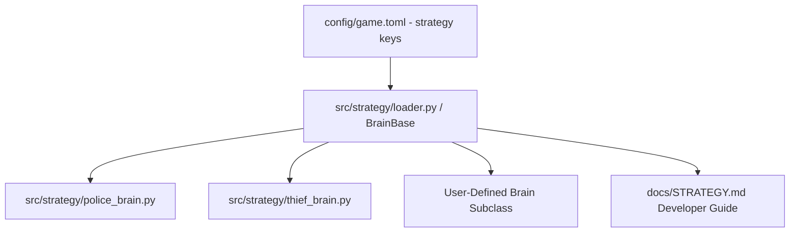

# Technical Development Plan
## Feature: Custom Strategy Brain Integration Guide (`police_custom_strategy_guide`)

### 1. Technical Architecture & Component Design
This plan specifies `police_custom_strategy_guide` documentation and class loader engineering as defined in `police_custom_strategy_guide_prd.md`.

### 2. Technical Component Breakdown
- **Component 1**: Author `docs/STRATEGY.md` with complete subclassing and API documentation.
- **Component 2**: Document `BrainBase` abstract methods (`_pick_move`, `_decide_move`).
- **Component 3**: Provide working examples of heuristic and Q-learning brains.

### 3. Dependencies & Internal Integrations
- **Language / Runtime**: Python 3.11+
- **Internal Modules**: `src/strategy/base_brain.py`, `src/strategy/police_brain.py`, `src/strategy/thief_brain.py`

### 4. Implementation Strategy & Risk Mitigation
- **Clean Interface**: Ensure docstrings and Markdown equations match theoretical Dec-POMDP formulation.
