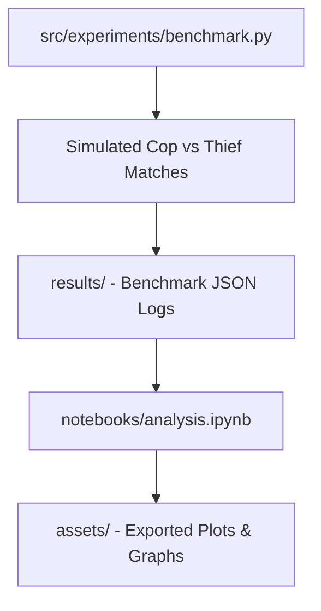

# Technical Development Plan
## Feature: Experimentation, Analysis Notebooks & Performance Benchmarking (`police_experimentation_notebooks`)

### 1. Technical Architecture & Component Design
This technical plan outlines the implementation of `police_experimentation_notebooks` based on `police_experimentation_notebooks_prd.md`.

### 2. Technical Component Breakdown
- **Component 1**: Create `src/experiments/benchmark.py` running automated game iterations.
- **Component 2**: Create `notebooks/analysis.ipynb` analyzing scent decay, Bayesian belief map updates, and capture efficiency.
- **Component 3**: Configure output directories `data/`, `results/`, and `assets/`.

### 3. Dependencies & Internal Integrations
- **Language / Runtime**: Python 3.11+, Jupyter Notebook
- **Internal Modules**: `src/domain/scent.py`, `src/domain/belief.py`, `src/strategy/police_brain.py`, `src/strategy/thief_brain.py`
- **External Libraries**: `matplotlib`, `numpy`, `json`, `dataclasses`

### 4. Implementation Strategy & Risk Mitigation
- **Phased Rollout**: Implement benchmark script first, record outputs to `results/`, then construct Jupyter notebook for visualization.
