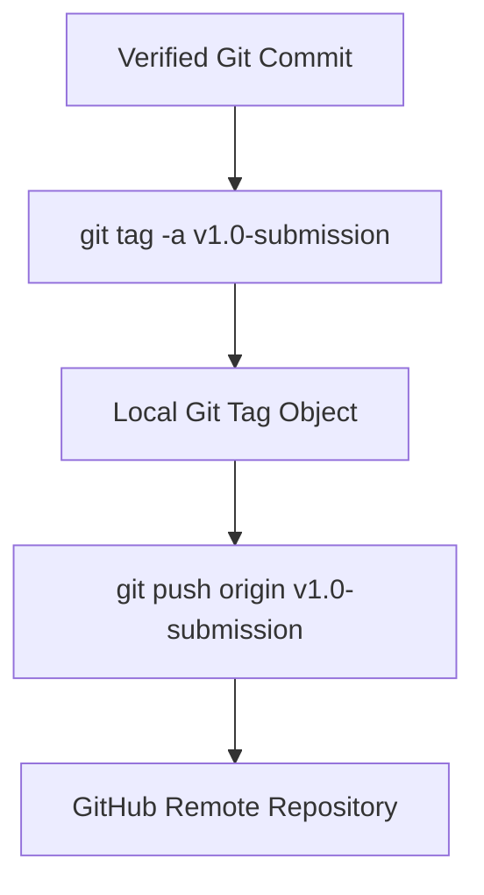

# Technical Development Plan
## Feature: Annotated Git Submission Tagging (`police_git_submission_tagging`)

### 1. Technical Architecture & Component Design
This plan outlines the tagging procedure specified in `police_git_submission_tagging_prd.md`.

### 2. Technical Component Breakdown
- **Component 1**: Verify working tree clean status (`git status`).
- **Component 2**: Execute annotated tag command (`git tag -a v1.0-submission`).
- **Component 3**: Push tag object to remote (`git push origin v1.0-submission`).

### 3. Dependencies & Internal Integrations
- **Runtime**: Git CLI, Python subprocess module.

### 4. Implementation Strategy & Risk Mitigation
- **Clean Tree Check**: Ensure zero untracked changes before creating release tag.
