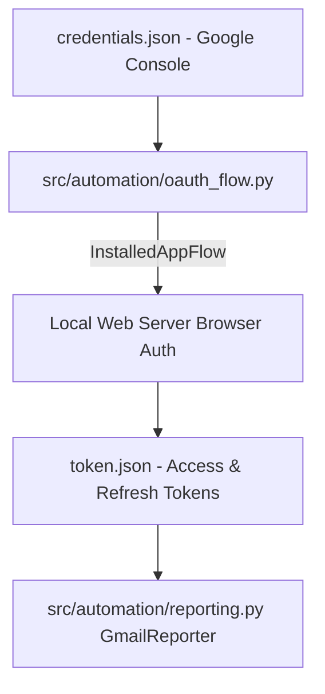

# Technical Development Plan
## Feature: Gmail OAuth 2.0 Setup Utility Flow (`police_gmail_oauth_setup_flow`)

### 1. Technical Architecture & Component Design
This plan outlines `police_gmail_oauth_setup_flow` engineering as specified in `police_gmail_oauth_setup_flow_prd.md`.

### 2. Technical Component Breakdown
- **Component 1**: Create `src/automation/oauth_flow.py` defining `OAuthSetupManager`.
- **Component 2**: Implement `get_credentials()` with automatic token refresh.
- **Component 3**: Implement CLI helper function to initiate local server flow.

### 3. Dependencies & Internal Integrations
- **Language / Runtime**: Python 3.11+
- **External Libraries**: `google-auth-oauthlib`, `google-auth-httplib2`, `google-api-python-client`

### 4. Implementation Strategy & Risk Mitigation
- **Mock Fallback**: If credentials are not present, return mock credential object so tests run without error.
