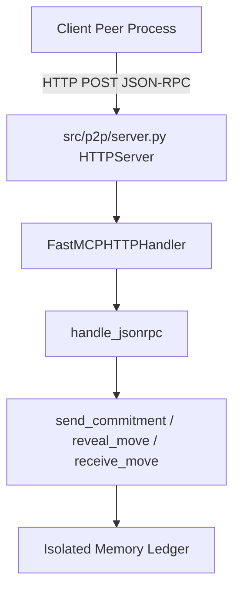

# Technical Development Plan
## Feature: P2P FastMCP HTTP Server Transport Binding (`police_http_p2p_network_server`)

### 1. Technical Architecture & Component Design
This plan specifies `police_http_p2p_network_server` engineering as defined in `police_http_p2p_network_server_prd.md`.

### 2. Technical Component Breakdown
- **Component 1**: Implement `FastMCPHTTPHandler(http.server.BaseHTTPRequestHandler)` in `src/p2p/server.py`.
- **Component 2**: Enhance `FastMCPServer.start(background=True)` to launch `HTTPServer` on background thread.
- **Component 3**: Implement `call_opponent(method, params)` using `urllib.request`.
- **Component 4**: Enhance `FastMCPServer.stop()` to cleanly close the socket.

### 3. Dependencies & Internal Integrations
- **Standard Libraries**: `http.server`, `threading`, `urllib.request`, `json`, `hashlib`

### 4. Implementation Strategy & Risk Mitigation
- **Daemon Thread**: Background thread marked as daemon so it never blocks Python process termination.
