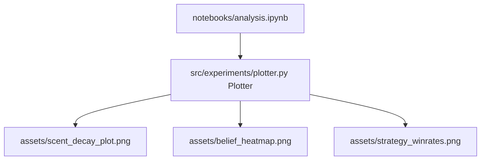

# Technical Development Plan
## Feature: Interactive Notebook Plots & Visualizations (`police_interactive_notebook_plots`)

### 1. Technical Architecture & Component Design
This plan outlines `police_interactive_notebook_plots` implementation as specified in `police_interactive_notebook_plots_prd.md`.

### 2. Technical Component Breakdown
- **Component 1**: Create `src/experiments/plotter.py` defining plotting utility functions.
- **Component 2**: Implement `generate_analysis_plots(results_dict)`.
- **Component 3**: Embed matplotlib calls in `notebooks/analysis.ipynb`.

### 3. Dependencies & Internal Integrations
- **Language / Runtime**: Python 3.11+, Jupyter Notebook
- **External Libraries**: `matplotlib`, `numpy`

### 4. Implementation Strategy & Risk Mitigation
- **Backend Selection**: Use `matplotlib.use('Agg')` when running headless in tests to avoid display environment errors.
