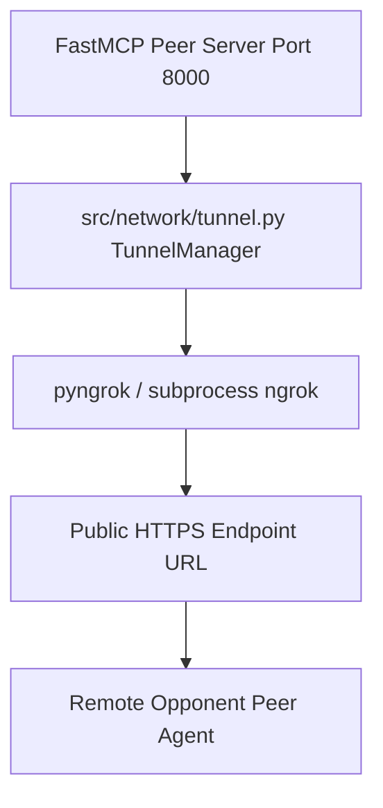

# Technical Development Plan
## Feature: Public Tunneling Integration (`police_ngrok_public_tunneling`)

### 1. Technical Architecture & Component Design
This plan outlines `police_ngrok_public_tunneling` engineering as specified in `police_ngrok_public_tunneling_prd.md`.

### 2. Technical Component Breakdown
- **Component 1**: Create `src/network/tunnel.py` defining `TunnelManager`.
- **Component 2**: Implement `start_tunnel(port: int) -> str`.
- **Component 3**: Implement `stop_tunnel()`.

### 3. Dependencies & Internal Integrations
- **Language / Runtime**: Python 3.11+
- **Internal Modules**: `src/p2p/server.py`, `src/network/mcp_server.py`
- **External Libraries**: `pyngrok` (or standard `subprocess` fallback)

### 4. Implementation Strategy & Risk Mitigation
- **Mock Mode**: If `ngrok` binary is absent, return mock localhost URL (`http://localhost:8000`) for test execution.
