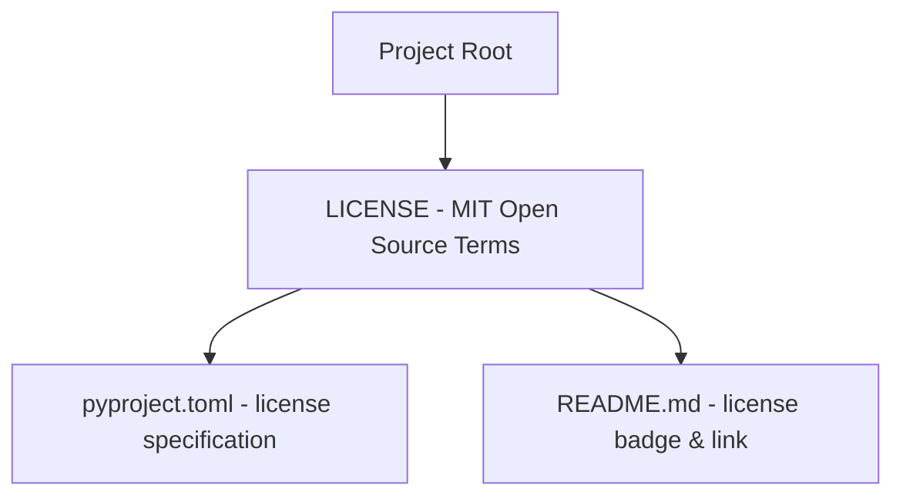

# Technical Development Plan
## Feature: Open-Source MIT License Configuration (`police_project_license_legal`)

### 1. Technical Architecture & Component Design
This plan outlines `police_project_license_legal` creation as defined in `police_project_license_legal_prd.md`.

### 2. Technical Component Breakdown
- **Component 1**: Create `LICENSE` file at root.
- **Component 2**: Link `LICENSE` in `README.md`.

### 3. Dependencies & Internal Integrations
- Standard MIT License text.
