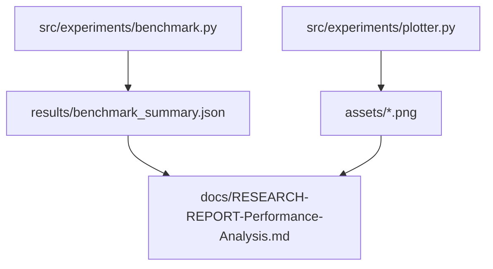

# Technical Development Plan
## Feature: Empirical Research & Performance Analysis Report (`police_research_performance_report`)

### 1. Technical Architecture & Component Design
This plan outlines `police_research_performance_report` authoring as specified in `police_research_performance_report_prd.md`.

### 2. Technical Component Breakdown
- **Component 1**: Author `docs/RESEARCH-REPORT-Performance-Analysis.md`.
- **Component 2**: Include empirical cost & token breakdown tables.
- **Component 3**: Include parameter sensitivity graphs and latency analysis.

### 3. Dependencies & Internal Integrations
- **Source Data**: `results/benchmark_summary.json`, `assets/`

### 4. Implementation Strategy & Risk Mitigation
- **Data Integrity**: Ensure reported metrics are consistent with actual code execution outputs.
