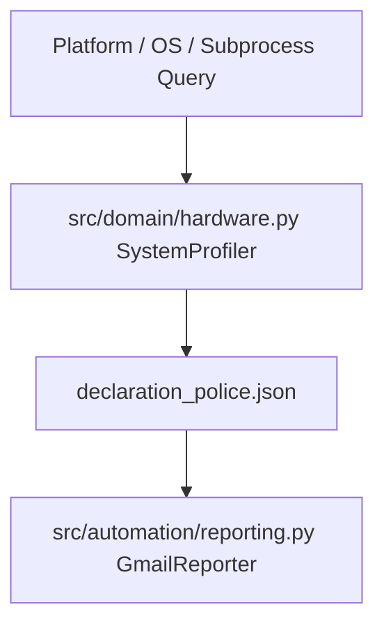

# Technical Development Plan
## Feature: Step-0 System Hardware Auto-Discovery (`police_step0_hardware_declaration`)

### 1. Technical Architecture & Component Design
This plan outlines `police_step0_hardware_declaration` as specified in `police_step0_hardware_declaration_prd.md`.

### 2. Technical Component Breakdown
- **Component 1**: Implement `SystemProfiler` class in `src/domain/hardware.py`.
- **Component 2**: Query platform details (`platform.system()`, `platform.python_version()`, `os.cpu_count()`).
- **Component 3**: Query Git commit hash via `subprocess.run(["git", "rev-parse", "HEAD"])`.
- **Component 4**: Integrate hardware dict into `GmailReporter` artifact compilation.

### 3. Dependencies & Internal Integrations
- **Language / Runtime**: Python 3.11+
- **Standard Libraries**: `platform`, `subprocess`, `sys`, `os`

### 4. Implementation Strategy & Risk Mitigation
- **Graceful Fallbacks**: Catch `subprocess.SubprocessError` and return fallback commit string `"0000000000000000000000000000000000000000"`.
