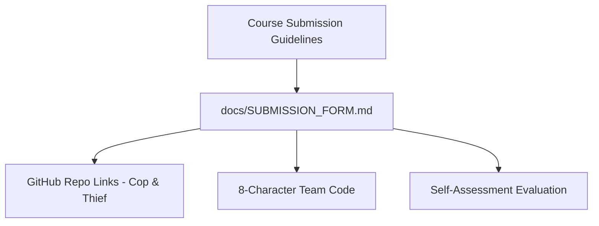

# Technical Development Plan
## Feature: Academic Submission Form Evaluation Summary (`police_submission_form_evaluation`)

### 1. Technical Architecture & Component Design
This plan outlines `police_submission_form_evaluation` authoring as specified in `police_submission_form_evaluation_prd.md`.

### 2. Technical Component Breakdown
- **Component 1**: Author `docs/SUBMISSION_FORM.md`.
- **Component 2**: Document submission code, member IDs, and cross-repo pointers.

### 3. Dependencies & Internal Integrations
- Reference: Chapter 11 and Table 11 of `police_thief_p2p.pdf`.
