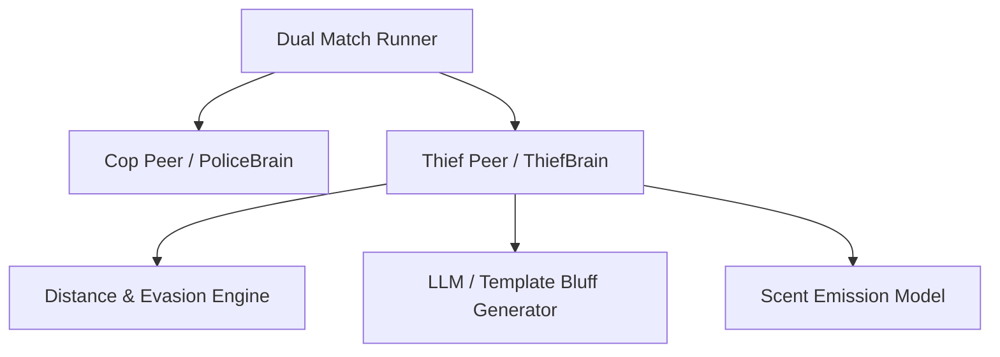

# Technical Development Plan
## Feature: Thief Evasion Strategy Brain & Dual Match Simulator (`police_thief_evasion_brain`)

### 1. Technical Architecture & Component Design
This development plan outlines the engineering implementation for `police_thief_evasion_brain` based on the requirements in `police_thief_evasion_brain_prd.md`.

### 2. Technical Component Breakdown
- **Component 1**: Create `src/strategy/thief_brain.py` defining `ThiefBrain(BrainBase)`.
- **Component 2**: Implement distance maximization heuristic evaluating legal non-blocked neighbors.
- **Component 3**: Implement deception engine generating inverse/misleading verbal direction hints.
- **Component 4**: Create `src/core/match_runner.py` integrating Cop and Thief peers in turn-by-turn simulation loop.

### 3. Dependencies & Internal Integrations
- **Language / Runtime**: Python 3.11+
- **Internal Modules**: `src/strategy/base_brain.py`, `src/domain/distance.py`, `src/domain/grid.py`, `src/core/orchestrator.py`
- **External Libraries**: `random`, `math`, `typing`, `dataclasses`

### 4. Implementation Strategy & Risk Mitigation
- **Phased Rollout**: Implement `ThiefBrain` move selection first, then add bluff generation, followed by `MatchRunner` integration.
- **Risk Mitigation**: Verify zero shared references between Cop and Thief state instances.
