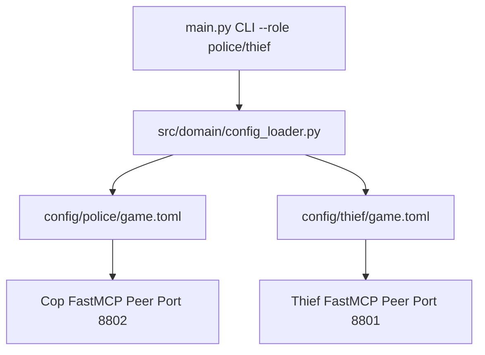

# Technical Development Plan
## Feature: Zero-Trust Peer Config Isolation (`police_zero_trust_peer_isolation`)

### 1. Technical Architecture & Component Design
This plan specifies `police_zero_trust_peer_isolation` architecture as defined in `police_zero_trust_peer_isolation_prd.md`.

### 2. Technical Component Breakdown
- **Component 1**: Create directory `config/police/` and `config/police/game.toml`.
- **Component 2**: Create directory `config/thief/` and `config/thief/game.toml`.
- **Component 3**: Update `ConfigLoader.load_private_config(role="police")` to resolve role subfolders.

### 3. Dependencies & Internal Integrations
- **Language / Runtime**: Python 3.11+
- **Internal Modules**: `src/domain/config_loader.py`, `src/cli.py`

### 4. Implementation Strategy & Risk Mitigation
- **Fallback Resolution**: Try `config/<role>/game.toml` first, then `config/game.toml`.
